# 📘 Plataforma Inteligente de Predicción y Análisis del S&P 500

Sistema integral que combina **análisis financiero avanzado**, **modelado matemático adaptativo** y **arquitectura multiagente basada en inteligencia artificial**.  
Su objetivo es proporcionar una herramienta educativa y técnica para comprender, analizar y predecir el comportamiento del índice **S&P 500** de forma explicativa y reproducible.

---

## Propósito del Proyecto

El proyecto busca integrar la rigurosidad del análisis cuantitativo con la capacidad explicativa de la inteligencia artificial moderna.  
La plataforma permite:

- Analizar movimientos históricos y actuales del S&P 500.  
- Generar predicciones mediante **series de Fourier adaptativas**.  
- Explicar los fenómenos de mercado con **modelos de lenguaje (LLMs)**.  
- Relacionar eventos financieros, noticias y métricas técnicas.  
- Enseñar conceptos de mercado y modelado de datos desde una perspectiva educativa.

---

## Arquitectura General del Sistema

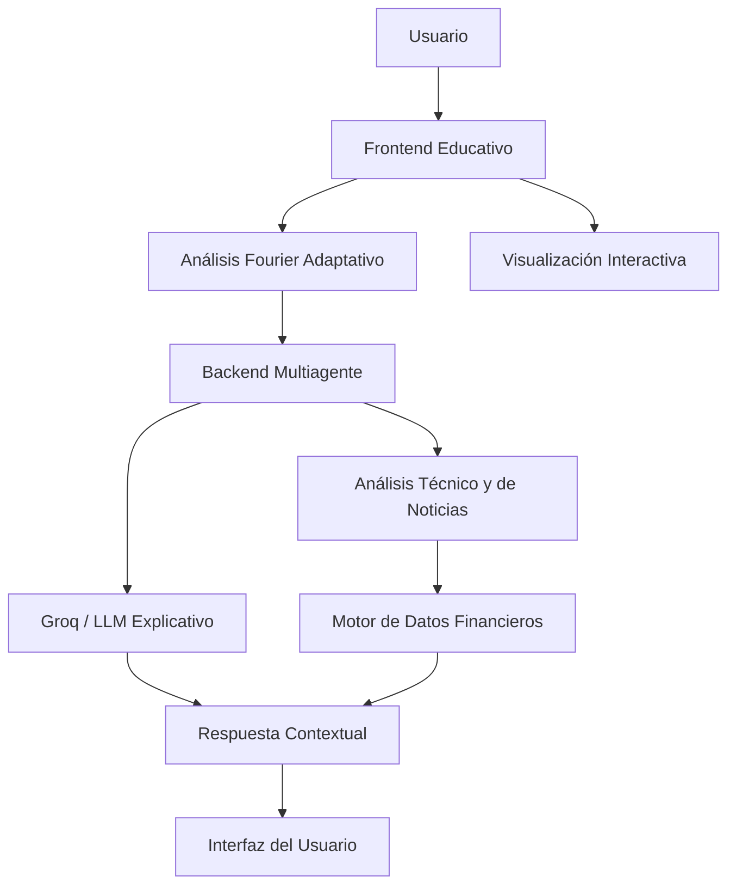

El sistema se estructura en dos grandes capas:  
1. **Frontend educativo:** orientado a la comprensión y visualización.  
2. **Backend analítico:** orientado al procesamiento, predicción y razonamiento contextual.  

---

## Fundamento Matemático

El componente de predicción se basa en la **serie de Fourier adaptativa**, donde los armónicos se ajustan dinámicamente según la volatilidad y el contexto reciente del mercado:

$$
f(t) = a_0 + \sum_{n=1}^{N} \left[ a_n \cos\left(\frac{2\pi n t}{T}\right) + b_n \sin\left(\frac{2\pi n t}{T}\right) \right]
$$

Los coeficientes \(a_n\) y \(b_n\) se recalculan para cada ventana temporal, permitiendo capturar cambios locales en la tendencia del índice.  
Esto genera un modelo flexible, capaz de representar tanto movimientos cíclicos como anomalías de corto plazo.

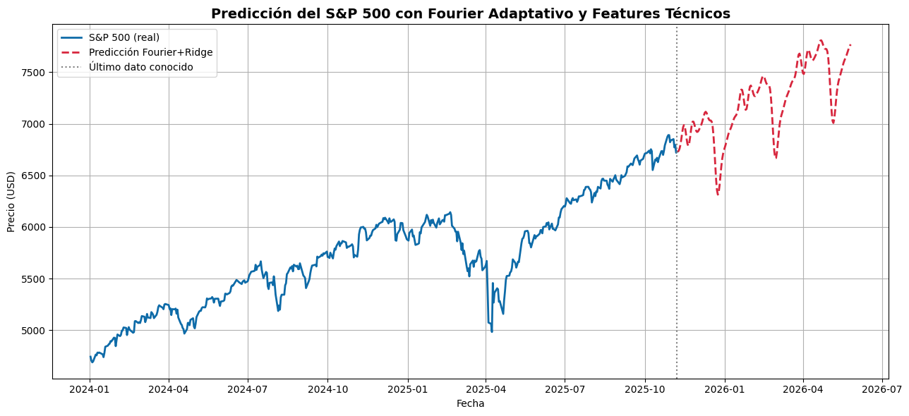
*Representación de la predicción obtenida mediante la serie de Fourier adaptativa. Cada componente armónica modela fluctuaciones locales del mercado, permitiendo capturar tanto oscilaciones suaves como picos abruptos en la tendencia del S&P 500. El modelo se recalibra dinámicamente por ventanas temporales, optimizando la capacidad de generalización.*
  
*Comparación mensual de las predicciones Fourier. Cada curva representa el ajuste del modelo frente a las variaciones reales del índice, mostrando la capacidad adaptativa de las series para responder a diferentes contextos económicos. Se observa cómo la frecuencia dominante cambia con la volatilidad de cada periodo.*

---

## Arquitectura Multiagente

Cada agente cumple una función específica dentro del ecosistema de análisis.

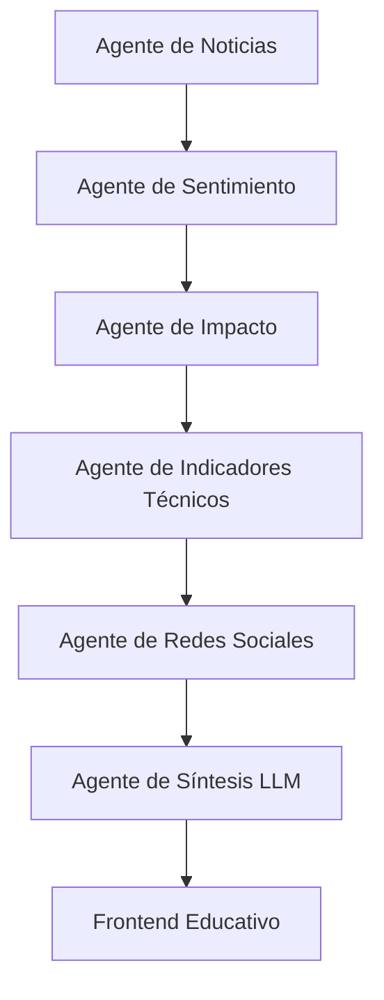

**Descripción de agentes principales:**

| Agente | Función Principal | Herramientas |
|--------|-------------------|---------------|
| `NewsScraperAgent` | Agrega y filtra noticias financieras | NewsAPI, BeautifulSoup |
| `SentimentAnalyzer` | Evalúa tono y sentimiento del mercado | VADER, TextBlob |
| `ImpactScorer` | Asigna peso a eventos según relevancia | Modelos heurísticos |
| `IndicatorsFetcher` | Calcula métricas técnicas (RSI, MACD, SMA) | TA-Lib, pandas |
| `SocialMediaAgent` | Analiza sentimiento en redes | Reddit API, PRAW |
| `LLMSynthesizer` | Genera explicaciones en lenguaje natural | Groq API, Llama 3 |
| `CacheManager` | Optimiza rendimiento mediante caché | Redis |

---

## Flujo de Predicción Fourier

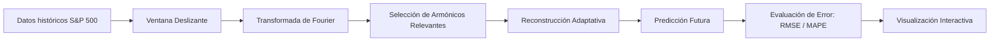

El modelo ajusta dinámicamente el número de armónicos según la complejidad local de la serie temporal, combinando precisión numérica y comprensión intuitiva del fenómeno.

---

## Flujo de Interacción General

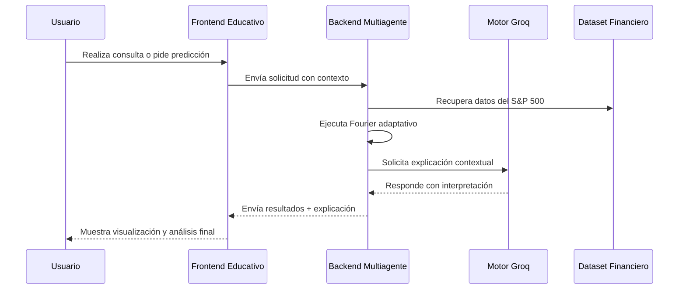

  
*Visualización de los datos históricos del índice S&P 500. Esta representación permite observar la evolución del mercado en periodos prolongados, destacando tendencias de largo plazo, puntos de inflexión y zonas de alta volatilidad. La información base se emplea como entrada para el modelo de Fourier adaptativo, garantizando consistencia estadística y continuidad temporal.*

---

  
*Ejemplo de la interpretación textual producida por el modelo de lenguaje integrado (LLM). La respuesta sintetiza los hallazgos cuantitativos —como tendencias detectadas o correlaciones— en un lenguaje comprensible, facilitando el aprendizaje de los procesos financieros. Este componente ilustra la capacidad explicativa del sistema para transformar datos técnicos en conocimiento contextualizado.*

---

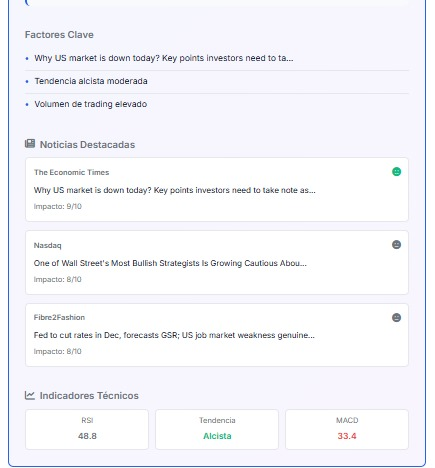  
*Interfaz de análisis de noticias y sentimiento de mercado. Cada elemento noticioso se evalúa mediante un modelo de análisis semántico que determina su polaridad (positiva, negativa o neutra). Esta información se integra al análisis técnico y a las predicciones Fourier para mejorar la interpretación causal de los movimientos del índice.*


---

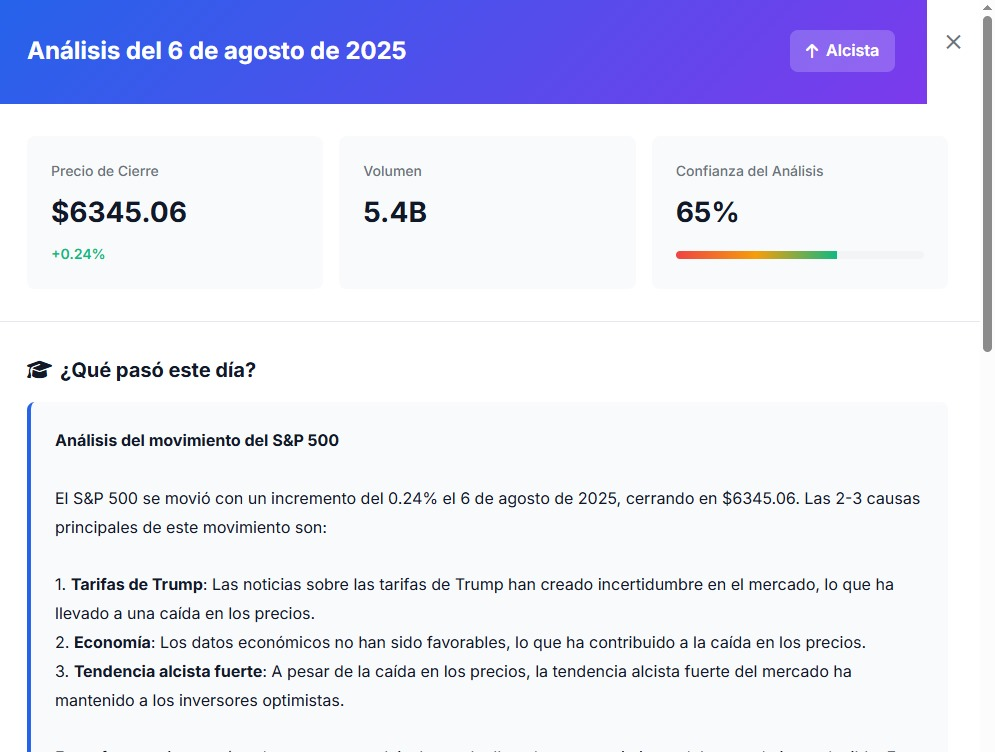  
*Cuando el usuario selecciona una fecha en especifico, entrega un resumen alrededor de ese dia, como el precio de cierre y un analisis de noticias corto.*


---

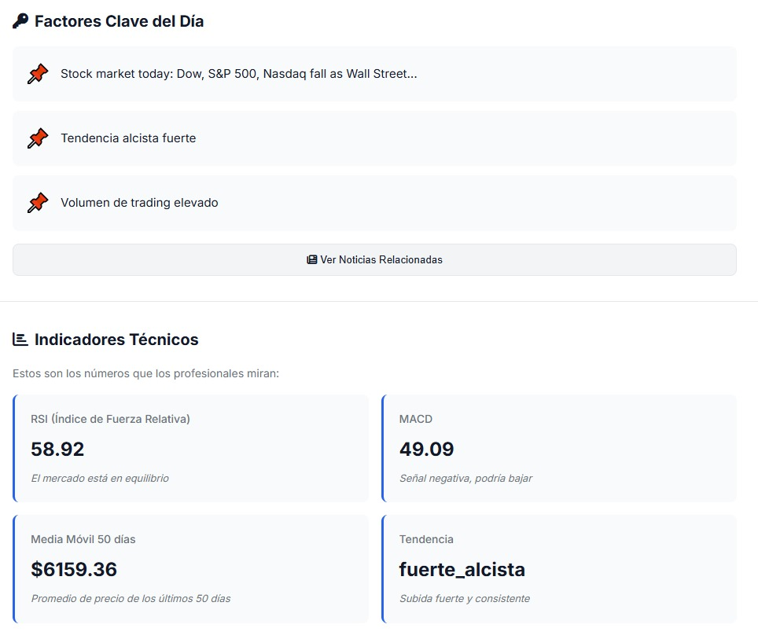  
*Interfaz de análisis de noticias, algunos factores claves e indicadores tecnicos para complementar la informacion anterior.*


---

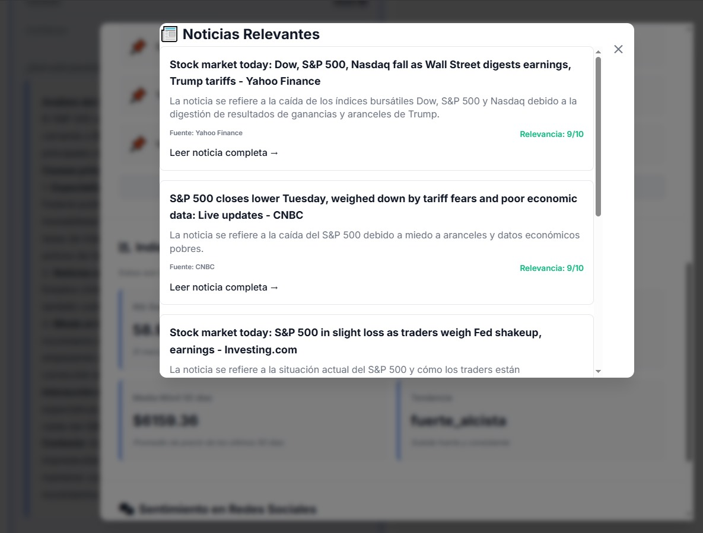  
*Por ultimo, muestra noticias relevantes de ese dia, con su respectivo link de acceso para ayudar a la educacion y adquisicion de conocimiento del usuario.*


---

## Tecnologías Principales

| Componente | Tecnología | Propósito |
|-------------|-------------|-----------|
| **Backend** | FastAPI, Uvicorn | API REST para procesamiento modular |
| **Frontend** | HTML5, CSS3, JavaScript, Chart.js | Interfaz educativa e interactiva |
| **Predicción Matemática** | NumPy, SciPy, Pandas | Cálculo de Fourier y análisis estadístico |
| **IA y LLMs** | Groq API (Llama 3), OpenAI Client | Generación de explicaciones |
| **Datos Financieros** | yFinance, Yahoo Finance API | Descarga de series históricas |
| **Análisis Técnico** | TA-Lib, scikit-learn | Indicadores de mercado y ML básico |
| **Noticias y Sentimiento** | NewsAPI, VADER, TextBlob | Evaluación contextual de eventos |
| **Caché y Rendimiento** | Redis | Almacenamiento temporal y optimización |
| **Visualización** | Chart.js, Mermaid | Representación gráfica sin imágenes externas |

---

## 🧾 Configuración y Uso

### 1. Requisitos

- Python 3.9 o superior  
- Claves de API para Groq y NewsAPI (opcional)  
- Redis (opcional, para caché distribuido)

### 2. Ejecución del Servidor

```bash
# Iniciar entorno virtual
python -m venv venv
source venv/bin/activate  # (Windows: venv\Scripts\activate)

# Instalar dependencias
pip install -r requirements.txt

# Ejecutar backend
uvicorn sp500_backend:app --host 0.0.0.0 --port 8000 --reload
```

### 3. Visualización Local

```bash
# Servidor local del frontend educativo
python -m http.server 8000
```

Luego abrir en navegador: [http://localhost:8000](http://localhost:8000)

---

## Interpretación Educativa de Resultados

El sistema devuelve tres tipos de información:

1. **Predicción Numérica:** tendencia futura estimada del S&P 500.  
2. **Análisis Fourier:** descomposición de componentes dominantes.  
3. **Explicación Causal:** texto generado por IA que interpreta los factores principales.  

> Ejemplo: “La tendencia alcista prevista se asocia con patrones armónicos similares a los observados en mayo de 2024 y un incremento positivo en el sentimiento de mercado derivado de noticias sobre política monetaria.”

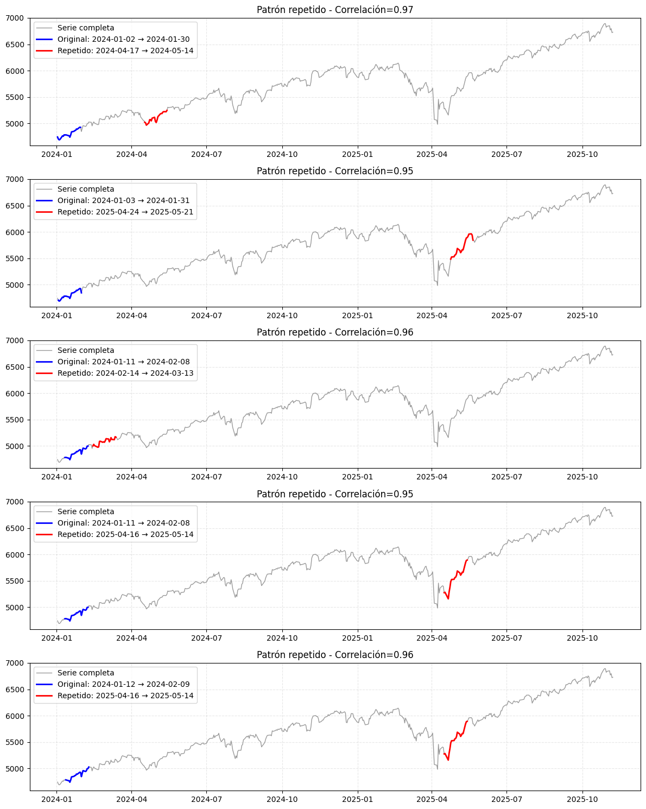  
*Visualización del proceso de detección de patrones históricos mediante Fourier adaptativo. El modelo identifica similitudes estructurales entre distintos periodos temporales del S&P 500, destacando ciclos recurrentes y zonas de transición entre fases alcistas y bajistas.*

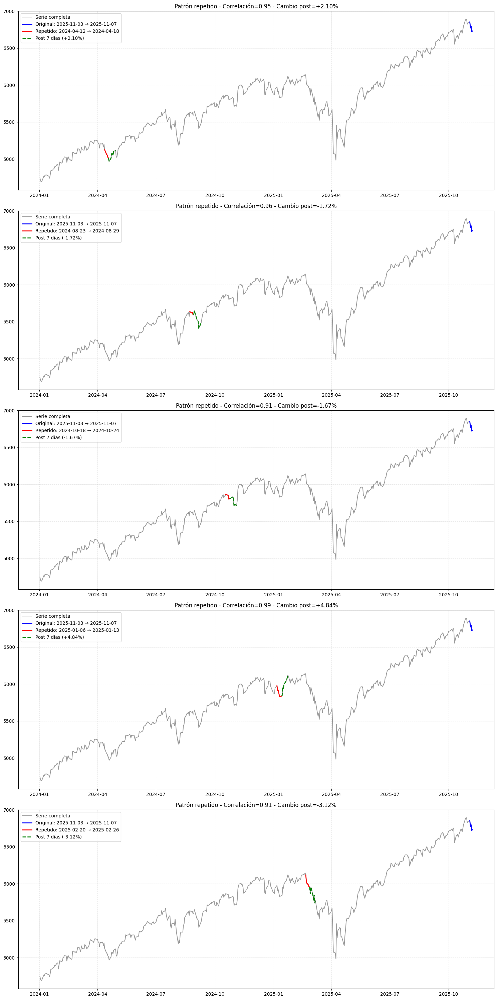  
*Análisis de los patrones identificados según su dirección de tendencia. Los armónicos se agrupan según su influencia positiva o negativa sobre el índice, lo que permite clasificar fases del mercado como potencialmente alcistas o bajistas. Este enfoque facilita la interpretación pedagógica de los componentes matemáticos.*

---

## Aprendizaje Sugerido

| Tema | Concepto Clave | Aplicación en el Proyecto |
|------|----------------|---------------------------|
| **Series de Fourier** | Descomposición de señales periódicas | Predicción adaptativa de precios |
| **Análisis de Sentimiento** | Evaluación semántica de noticias | Causalidad en movimientos de mercado |
| **Modelos Multiagente** | Coordinación entre componentes autónomos | Integración de fuentes y tareas |
| **Machine Learning Financiero** | Aprendizaje supervisado y ajuste de patrones | Comparación con Fourier adaptativo |
| **IA Explicativa (XAI)** | Interpretabilidad de resultados | Traducción de datos complejos a lenguaje natural |

---

## Extensiones Futuras

- Implementar Fourier híbrido con LSTM o Transformers.  
- Incluir detección automática de ciclos de mercado.  
- Añadir agente de política monetaria y correlación intermercado.  
- Incorporar un tablero educativo interactivo con métricas de rendimiento.  

---

## Licencia

**Licencia MIT** — Uso libre para fines académicos y de investigación.  
Desarrollado por **Emmanuel Ascendra, Jose Quiñonez, Joel Gonzales, Angel Salamanca, Luis Ortega**, bajo un enfoque educativo y de divulgación científica.

---
